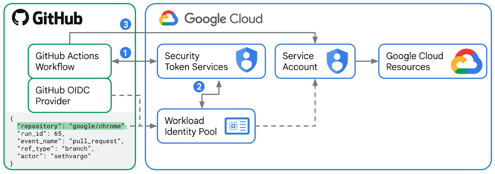

# GCP Deployment Prerequisite

To trigger the `terraform apply` command and create the configured resources within Google Cloud Platform (GCP) using GitHub Actions, we utilize Web Identity Federation (WIF). Web Identity Federation enables fine-grained scoping, short-lived credentials, and minimal management overhead for authentication.

## Web Identity Federation Overview

Web Identity Federation allows you to delegate access to your GCP resources using identity providers like GitHub Actions. It leverages OpenID Connect (OIDC) to establish a trust relationship between the identity provider and GCP, allowing secure authentication and authorization.

By setting up Web Identity Federation with GitHub Actions, you can establish a secure connection between GitHub and GCP, ensuring that the Terraform deployment process has the necessary permissions to create resources.




## Setting up Identity Federation for GitHub Actions

To use the new GitHub Actions auth action with Workload Identity Federation, you need to perform the following steps:

1. Create a Workload Identity Pool:

Use the following command to create a Workload Identity Pool:

```
gcloud iam workload-identity-pools create "auto-provision-x-identity-pool" \
  --project="${GCP_PROJECT_ID}" \
  --location="global" \
  --display-name="auto-provision-x-identity-pool"
```

2. Create a Workload Identity Provider:

Use the following command to create a Workload Identity Provider:

```
gcloud iam workload-identity-pools providers create-oidc "auto-provision-x-oidc-provider" \
  --project="${GCP_PROJECT_ID}" \
  --location="global" \
  --workload-identity-pool="auto-provision-x-identity-pool" \
  --display-name="auto-provision-x-oidc-provider" \
  --attribute-mapping="google.subject=assertion.sub,attribute.actor=assertion.actor,attribute.aud=assertion.aud,attribute.repository=assertion.repository,attribute.ref_type=assertion.ref_type" \
  --issuer-uri="https://token.actions.githubusercontent.com"

```

The attribute mappings map claims in the GitHub Actions JSON Web Token (JWT) to assertions that can be used to make further authentication restrictions, such as repository or GitHub username.

3. Allow authentications from the Workload Identity Provider to impersonate the desired Service Account:

Use the following command to add IAM policy binding:

```
gcloud iam service-accounts add-iam-policy-binding "auto-provision-x@${GCP_PROJECT_ID}.iam.gserviceaccount.com" \
  --project="${GCP_PROJECT_ID}" \
  --role="roles/iam.workloadIdentityUser" \
  --member="principalSet://iam.googleapis.com/projects/${GCP_ACCOUNT_ID}/locations/global/workloadIdentityPools/auto-provision-x-identity-pool/attribute.repository/garganshulgarg/auto-provision-x"
```

This allows the Workload Identity Provider to authenticate as the specified Service Account.


Once the above configurations are complete, you need to modify the GitHub Actions workflow file to include the following section:

```
- id: 'google-auth'
  name: 'Authenticate to Google Cloud'
  uses: 'google-github-actions/auth@v0.4.0'
  with:
    token_format: 'access_token'
    workload_identity_provider: 'projects/${GCP_ACCOUNT_ID}/locations/global/workloadIdentityPools/auto-provision-x-identity-pool/providers/auto-provision-x-oidc-provider'
    service_account: 'auto-provision-x@${GCP_PROJECT_ID}.iam.gserviceaccount.com'
```

This section authenticates the workflow to Google Cloud using the specified Workload Identity Provider and Service Account.

By following these steps, you can set up Workload Identity Federations and leverage them with GitHub Actions to trigger Terraform deployments securely.

Please ensure that you adjust the commands, configurations, and workflow file to match your specific project requirements.


## Reference
[Enabling keyless authentication from GitHub Actions](https://cloud.google.com/blog/products/identity-security/enabling-keyless-authentication-from-github-actions)

